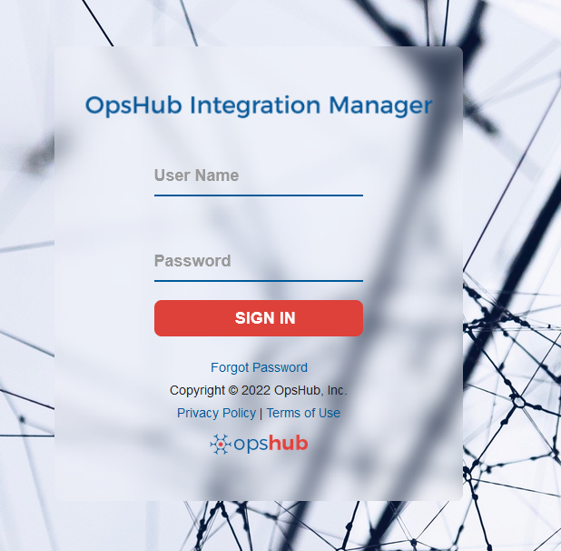

Let's see how you can get started with OpsHub Integration Manager.

# Windows
* On Logging in page: Once the installation is complete, OpsHub Integration Manager will be started automatically if you are doing installation on windows machine and you will be re-directed to the Getting started page in the default web browser. If the OpsHub Integration Manager is not started, you can start it manually as described [here](start-or-stop-application-service).
* For launching the application, click on the link **Launch OpsHub Integration Manager**. It will redirect to the login page.
* Log in with the following credentials:
  - username: admin
  - password: password
 
  

These are default credentials. You can change them after you log in.

# Linux
* For Linux, once the installation is done, enter the URL as http://localhost:8989/OIM/ in browser.
* Log in as username **admin** and password **password**. These are default username and password. You can change them from profile once you log in.
* If you have configured OpsHub Integration Manager for HTTPS, then enter the URL as https://localhost:8443/OIM/ in browser.

Once you have logged in the application, you are ready to start integration configuration. Click [Overview of Integration](../Manage/Administrator/schedular.md) to understand how to start using OpsHub Integration Manager for integration.




